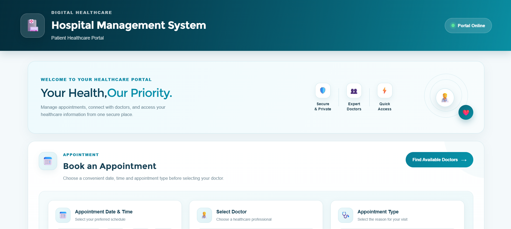
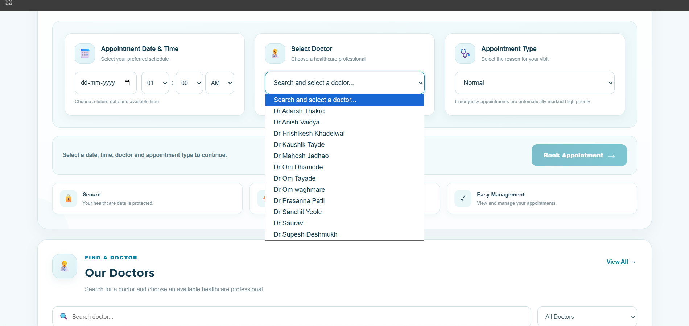
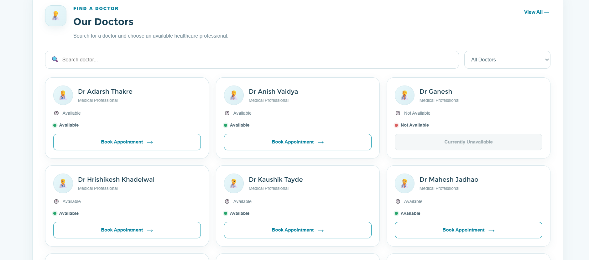
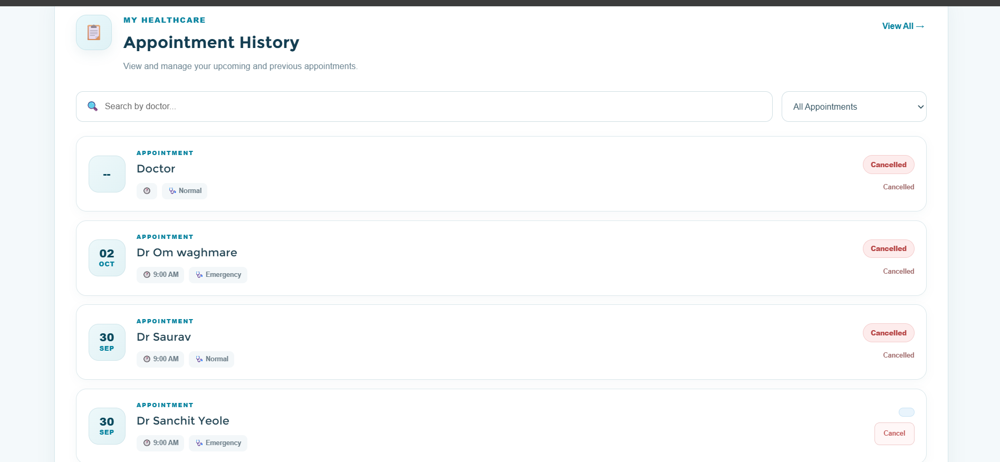
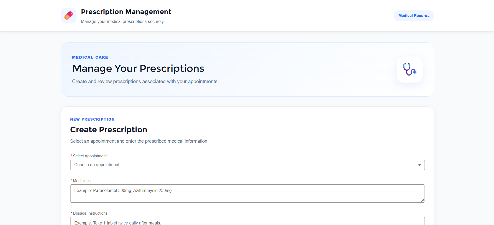
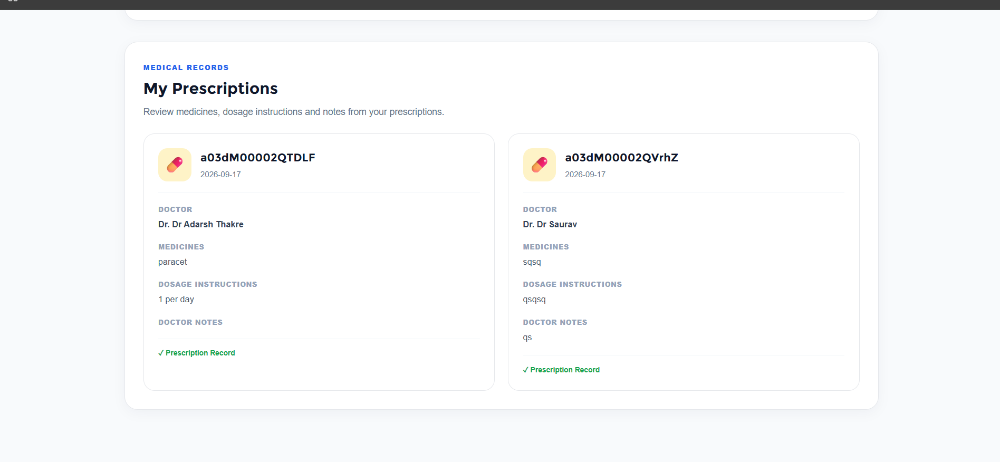

# 🏥 Hospital Management System – Salesforce

A Salesforce-based Hospital Management System designed to manage patients, doctors, appointments, and prescriptions through a centralized healthcare portal.

This project demonstrates practical Salesforce development using **Apex, SOQL, DML, Triggers, Lightning Web Components (LWC), Salesforce Flow, Reports, Dashboards, Permission Sets, Experience Cloud, Salesforce CLI, Git, and GitHub**.

---

## 📌 Project Overview

The Hospital Management System provides a digital healthcare portal where patients can:

* 👨‍⚕️ View available doctors
* 🔎 Search and filter doctors
* 🟢 Check doctor availability
* 📅 Book appointments
* 🚨 Select Normal or Emergency appointments
* ⚡ Automatically assign appointment priority
* 📋 View appointment history
* ❌ Cancel appointments
* 💊 View prescriptions
* 📝 Create prescriptions for appointments
* 🌐 Access the application through Salesforce Experience Cloud

The system also implements server-side business rules using Apex to validate appointments and maintain data consistency.

---

## 🎯 Objectives

The main objectives of this project are:

* Build a real-world Salesforce application from scratch
* Implement Salesforce data modeling
* Develop Apex business logic
* Implement Apex Trigger and Trigger Handler patterns
* Build reusable Lightning Web Components
* Automate business processes using Salesforce Flow
* Implement security and access control
* Create reports and dashboards
* Provide a patient-facing Experience Cloud portal
* Practice Salesforce DX development
* Manage the project using Git and GitHub

---

## 🏗️ Salesforce Architecture

```text
                    ┌──────────────────────────┐
                    │     Experience Cloud     │
                    │    Patient Healthcare     │
                    │          Portal           │
                    └────────────┬─────────────┘
                                 │
                                 ▼
                    ┌──────────────────────────┐
                    │        LWC Layer          │
                    │                          │
                    │ Hospital Appointment      │
                    │ Portal                   │
                    │                          │
                    │ Prescription Manager     │
                    └────────────┬─────────────┘
                                 │
                                 ▼
                    ┌──────────────────────────┐
                    │       Apex Layer          │
                    │                          │
                    │ HospitalDoctorController │
                    │ AppointmentHandler       │
                    └────────────┬─────────────┘
                                 │
                    ┌────────────┴────────────┐
                    │                         │
                    ▼                         ▼
          ┌──────────────────┐      ┌──────────────────┐
          │   Apex Trigger   │      │ Salesforce Flow  │
          │                  │      │                  │
          │ Appointment      │      │   Automation     │
          │ Conflict Trigger │      │                  │
          └────────┬─────────┘      └────────┬─────────┘
                   │                         │
                   └────────────┬────────────┘
                                ▼
                    ┌──────────────────────────┐
                    │   Salesforce Data Model   │
                    │                          │
                    │ Patient                  │
                    │ Doctor                   │
                    │ Appointment              │
                    │ Prescription             │
                    └──────────────────────────┘
```

---

## 🖥️ Application Screenshots

### 🏥 Patient Healthcare Portal



### 📅 Appointment Booking



### 👨‍⚕️ Doctor List



### 📋 Appointment History



### 💊 Prescription Management



### 🏥 Medical Records



---

## 🗃️ Salesforce Data Model

The application uses four primary custom objects:

| Object            | Purpose                                    |
| ----------------- | ------------------------------------------ |
| `Patient__c`      | Stores patient information                 |
| `Doctor__c`       | Stores doctor information and availability |
| `Appointment__c`  | Stores appointment details                 |
| `Prescription__c` | Stores prescription information            |

### Relationships

```text
Patient
   │
   │ 1
   │
   ▼
Appointment
   │
   ├──────────────► Doctor
   │
   │
   ▼
Prescription
```

### Main Appointment Relationships

* Appointment → Patient
* Appointment → Doctor
* Prescription → Appointment

---

## 👤 Patient

The `Patient__c` object stores patient information.

### Important Fields

* Patient Name
* Age
* Email
* Phone

The patient's Salesforce user email is used by the Apex controller to locate the corresponding patient profile during appointment booking.

---

## 👨‍⚕️ Doctor

The `Doctor__c` object stores doctor information.

### Important Fields

* Doctor Name
* Specialization
* Availability

### Availability

Doctors can have availability such as:

* `Available`
* `Not Available`

The application prevents appointment booking when a doctor is marked as unavailable.

---

## 📅 Appointment

The `Appointment__c` object manages patient appointments.

### Important Fields

* Appointment Date & Time
* Patient
* Doctor
* Type
* Priority
* Status

### Appointment Types

* Normal
* Emergency

### Priority Logic

Emergency appointments receive:

```text
Emergency → High Priority
```

Normal appointments receive:

```text
Normal → Medium Priority
```

This logic is implemented in Apex.

---

## 💊 Prescription

The `Prescription__c` object stores prescription information.

### Important Fields

* Appointment
* Prescription Date
* Medicines
* Dosage Instructions
* Doctor Notes

Prescriptions are associated with appointments.

---

## ⚙️ Key Features

### 👨‍⚕️ Doctor Management

* Display doctors
* Search doctors by name
* Filter doctors by availability
* Display doctor availability
* Prevent booking with unavailable doctors

### 📅 Appointment Management

* Select appointment date and time
* Select doctor
* Select appointment type
* Book appointment
* Automatically assign priority
* View appointment history
* Search appointments
* Filter appointments
* Cancel appointments

### 🚨 Emergency Appointment

Emergency appointments automatically receive:

```text
Priority = High
```

Normal appointments receive:

```text
Priority = Medium
```

### 💊 Prescription Management

* Select appointment
* Add medicines
* Add dosage instructions
* Add doctor notes
* Create prescription
* View prescription information

---

## ⚡ Apex Development

The project uses Apex for server-side business logic.

### Apex Classes

```text
HospitalDoctorController
AppointmentHandler
AppointmentHandlerTest
```

---

## 🎮 HospitalDoctorController

`HospitalDoctorController` provides the backend services used by the Lightning Web Component.

### Main Methods

```text
getDoctors()
bookAppointment()
getMyAppointments()
getMyPrescriptions()
cancelAppointment()
createPrescription()
```

### Responsibilities

* Retrieve doctors
* Validate appointment requests
* Identify patient profiles
* Book appointments
* Retrieve patient appointments
* Retrieve prescriptions
* Cancel appointments
* Create prescriptions
* Handle Apex exceptions
* Return user-friendly error messages

---

## 🔥 Apex Trigger

The project uses an Apex Trigger on `Appointment__c`.

### Trigger

```text
AppointmentConflictTrigger
```

The trigger executes before appointment insertion.

Its purpose is to delegate business logic to the handler class.

---

## 🧩 Trigger Handler Pattern

Business logic is separated from the trigger using:

```text
AppointmentConflictTrigger
          │
          ▼
AppointmentHandler
```

This approach keeps the trigger lightweight and makes the business logic easier to maintain and test.

---

## 🛡️ Appointment Validation

The application performs server-side validation for appointments.

### Doctor Availability

If the selected doctor is unavailable:

```text
Doctor is currently not available.
```

The appointment is rejected.

### Appointment Conflict

The system checks whether the same doctor already has an appointment at the selected date and time.

If a conflict exists:

```text
Doctor already has an appointment at this time.
```

The appointment is rejected.

### Future Date Validation

Appointments must be scheduled for a future date and time.

---

## 🧪 Apex Testing

The project includes:

```text
AppointmentHandlerTest
```

The test class covers important business scenarios including:

* Emergency priority assignment
* Doctor availability validation
* Appointment conflict validation
* Bulk appointment processing

The project follows Salesforce Apex testing practices to verify server-side business logic.

---

## 💻 Lightning Web Components

The application uses Lightning Web Components for the user interface.

### LWC Components

```text
hospitalAppointmentPortal
prescriptionManager
```

### Hospital Appointment Portal

The portal provides:

* Welcome section
* Appointment booking
* Doctor search
* Doctor availability filter
* Appointment history
* Appointment search
* Appointment type filtering
* Appointment cancellation
* Quick access functionality

### Prescription Manager

The prescription component provides functionality for managing prescriptions associated with appointments.

---

## 🔄 Salesforce Flow

Salesforce Flow is used for process automation within the application.

The Flow layer complements the Apex business logic and provides declarative automation.

---

## 📊 Reports and Dashboards

The project includes Salesforce reporting and dashboard functionality for monitoring hospital operations.

### Reports

Examples include:

* Appointment Report
* Doctor Report
* Appointment Type Report
* Appointment Priority Report

### Dashboard

The Hospital Management Dashboard can be used to monitor:

* Appointment status
* Appointment types
* Appointment priorities
* Doctor availability
* Appointment trends

---

## 🔐 Security and Access Control

The application uses Salesforce security features including:

* Permission Sets
* Object-level permissions
* Field-level security
* Record-level access
* Apex sharing controls

### Permission Set

```text
Hospital Management User
```

The permission set provides appropriate access to the application's Salesforce objects and Apex functionality.

---

## 🌐 Experience Cloud

The application is exposed through Salesforce Experience Cloud as a patient-facing healthcare portal.

The Experience Cloud portal provides access to:

```text
Patient Healthcare Portal
        │
        ├── Doctor Search
        ├── Appointment Booking
        ├── Appointment History
        └── Prescription Management
```

---

## 🔄 Application Workflow

```text
Patient
   │
   ▼
Experience Cloud Portal
   │
   ▼
Select Doctor
   │
   ▼
Check Availability
   │
   ▼
Select Date & Time
   │
   ▼
Select Appointment Type
   │
   ├── Normal ──────► Medium Priority
   │
   └── Emergency ──► High Priority
   │
   ▼
Apex Validation
   │
   ├── Doctor Availability
   ├── Appointment Conflict
   └── Future Date Validation
   │
   ▼
Appointment Created
   │
   ▼
Appointment History
   │
   ▼
Prescription Management
```

---

## 🛠️ Technologies Used

### Salesforce

* Salesforce CRM
* Apex
* SOQL
* DML
* Apex Triggers
* Trigger Handler Pattern
* Lightning Web Components
* Salesforce Flow
* Reports
* Dashboards
* Permission Sets
* Experience Cloud

### Development Tools

* Visual Studio Code
* Salesforce CLI
* Git
* GitHub

### Languages

* Apex
* JavaScript
* HTML
* CSS
* SOQL
* XML

---

## 📁 Project Structure

```text
HospitalManagementSystem/
│
├── force-app/
│   └── main/
│       └── default/
│           ├── classes/
│           │   ├── AppointmentHandler.cls
│           │   ├── AppointmentHandler.cls-meta.xml
│           │   ├── AppointmentHandlerTest.cls
│           │   ├── AppointmentHandlerTest.cls-meta.xml
│           │   ├── HospitalDoctorController.cls
│           │   └── HospitalDoctorController.cls-meta.xml
│           │
│           ├── lwc/
│           │   ├── hospitalAppointmentPortal/
│           │   └── prescriptionManager/
│           │
│           ├── objects/
│           │   ├── Appointment__c/
│           │   ├── Doctor__c/
│           │   ├── Patient__c/
│           │   └── Prescription__c/
│           │
│           ├── triggers/
│           │   ├── AppointmentConflictTrigger.trigger
│           │   └── AppointmentConflictTrigger.trigger-meta.xml
│           │
│           ├── flows/
│           ├── reports/
│           ├── dashboards/
│           └── permissionsets/
│
├── Screenshots/
│   ├── portal-home.png
│   ├── appointment-booking.png
│   ├── doctorlist.png
│   ├── Appointmenthistory.png
│   ├── manageprescription.png
│   └── medicalrecords.png
│
├── README.md
├── sfdx-project.json
├── package.json
└── .gitignore
```

---

## 🧑‍💻 Salesforce CLI Commands

### Authenticate an Org

```bash
sf org login web
```

### List Connected Orgs

```bash
sf org list
```

### Deploy Metadata

```bash
sf project deploy start --target-org="YOUR_ORG_ALIAS"
```

### Deploy Apex Classes

```bash
sf project deploy start --target-org="YOUR_ORG_ALIAS" --source-dir force-app/main/default/classes
```

### Deploy LWC

```bash
sf project deploy start --target-org="YOUR_ORG_ALIAS" --source-dir force-app/main/default/lwc
```

### Run Apex Tests

```bash
sf apex run test --target-org="YOUR_ORG_ALIAS" --class-names AppointmentHandlerTest --result-format human --wait 10
```

---

## 🔄 Git and GitHub

The project is managed using Git and GitHub.

### Initialize Repository

```bash
git init
```

### Check Status

```bash
git status
```

### Add Changes

```bash
git add .
```

### Commit Changes

```bash
git commit -m "Update Hospital Management System"
```

### Push Changes

```bash
git push origin main
```

---

## 📌 Project Highlights

### Salesforce Development

* Custom Salesforce data model
* Apex controller
* Apex trigger
* Trigger handler
* Apex test class
* SOQL and DML
* Lightning Web Components
* Salesforce Flow

### Application Features

* Patient management
* Doctor management
* Appointment booking
* Emergency appointment handling
* Appointment conflict prevention
* Doctor availability validation
* Appointment cancellation
* Prescription management
* Experience Cloud portal

### Development Practices

* Bulkified Apex logic
* Separation of trigger and business logic
* Server-side validation
* Exception handling
* Salesforce DX project structure
* Git version control

---

## 🚀 Future Enhancements

Possible future improvements include:

* 🤖 AI-based patient assistance
* 📱 Mobile-friendly healthcare application
* 🔔 Appointment reminders
* 📧 Automated email notifications
* 📊 Advanced analytics
* 🧠 AI-based appointment recommendations
* 💳 Online payment integration
* 🏥 Hospital staff management
* 📈 Advanced healthcare dashboards
* 🔐 Enhanced external-user security

---

## 📚 Learning Outcomes

This project provided practical experience in:

* Salesforce Administration
* Salesforce Development
* Apex Programming
* SOQL and DML
* Apex Triggers
* Trigger Handler Design
* Apex Testing
* Lightning Web Components
* Salesforce Flow
* Salesforce Security
* Experience Cloud
* Salesforce CLI
* Salesforce DX
* Git and GitHub

---

## 🎓 Project Information

**Project:** Hospital Management System

**Platform:** Salesforce

**Domain:** Healthcare Management

**Development Approach:** Salesforce DX

**Frontend:** Lightning Web Components

**Backend:** Apex

**Automation:** Salesforce Flow and Apex

**Version Control:** Git & GitHub

---

## 👨‍💻 Developer

**Supesh Deshmukh**

Final-Year Computer Science Engineering Student

Salesforce Developer | Apex | LWC | SOQL | Salesforce Platform

---

## ⭐ Repository

GitHub Repository:

**hospital-management-system-salesforce**

If you find this project useful, feel free to explore the source code and Salesforce implementation.

---
